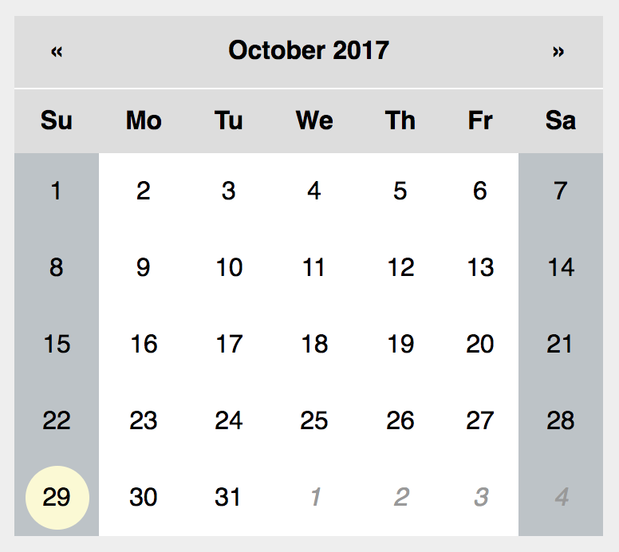
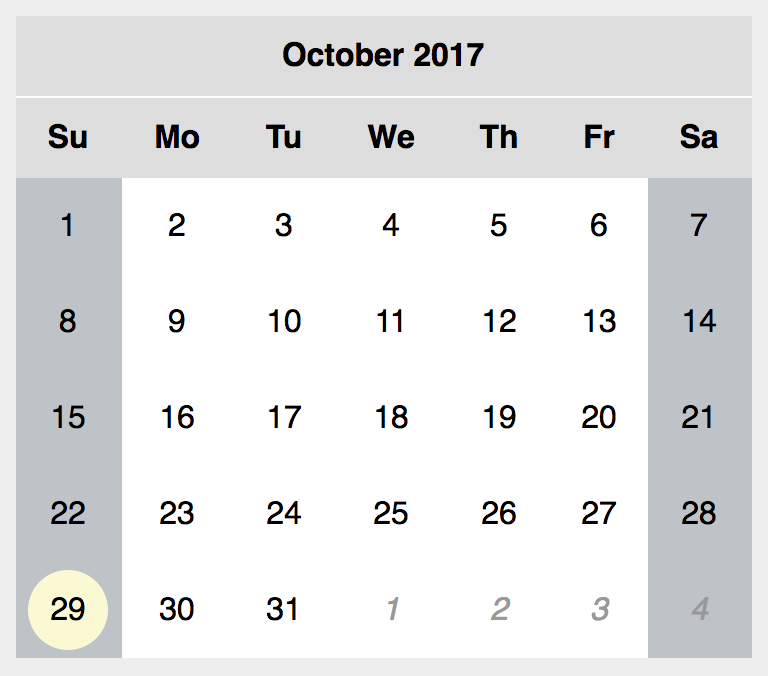
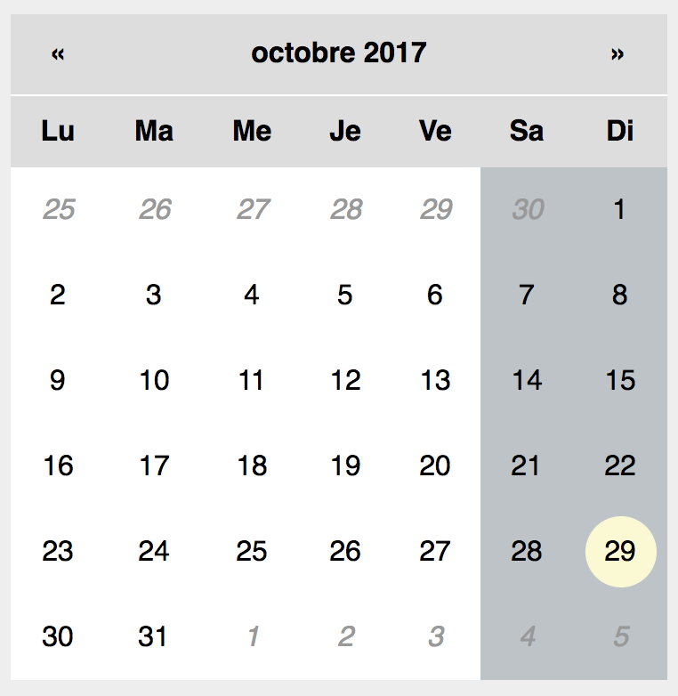

# React Calendar Pane

[](https://travis-ci.org/tomkp/react-calendar-pane)
[](https://coveralls.io/r/tomkp/react-calendar-pane?branch=master)


React calendar component in ES6

Check out the [demo](http://react-calendar-pane.surge.sh/)


install
```npm install```

run tests
```npm test```

build the demo
```npm run demo```


## Usage


```html
   <Calendar date={moment("23/10/2015", "DD/MM/YYYY")} onSelect={this.onSelect} />
```

<div align="center">
  
  
  
</div>

### Example css

```css
    .Calendar {
        border-collapse: collapse;
        padding: 0;
        margin: 4rem auto 0;
    }

    .Calendar th,
    .Calendar td {
        padding: 1rem;
        text-align: center;
    }

    .Day:hover {
        background: #eee;
        color: #000;
    }

    .Day.today {
        background: #666;
        color: #fff;
    }

    .Day.selected {
        background: #2980b9;
        color: #fff;
    }

    .Day.other-month {
        background: #fafafa;
        color: #aaa;
    }
```


